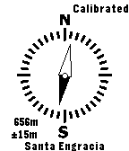

andevas
=======

andevas (spanish slang for "where'ya heading") is a location-aware Pebble app which will:
- Fetch your current position from your phone's GPS (using PebbleKit JS).
- Get the nearest point to you from a [CartoDB](http://cartodb.com/) table over the SQL API.
- Calculate the bearing and distance to that place (on the phone).
- Send that info to the Pebble using AppSync and then use Pebble's compass to show where the place is, with the distance (and precision) and an arrow pointing to it.

It is based on Pebble's own Compass example. This is why the UI is like a compass for now, but the north (dark half of the needle) is pointing to where the set place is.

Currently it has no settings screen, nor any way to change the data source.

However, it will now fetch the location of the nearest [BiciMad](http://bicimad.com) bike-share point (from a public table in my account).

## TODO
- Make a proper UI (maybe a 3D arrow using also accelerometer data to match watch inclination). And an icon.
- Be smarter about location-fetching (right now it just subscribes to HTML5 getLocation with high precision, which at least on Android uses GPS always). Maybe activating high precision only when distance < 500m or reducing lifecycles.
- Be smarter when querying the SQL API.
- Be able to configure the table to fetch info from.
- ~~Make it fetch places from [some sort of cloud geospatial database](http://cartodb.com/).~~
- ~~Maybe, make it a watchapp instead of a watchface.~~
